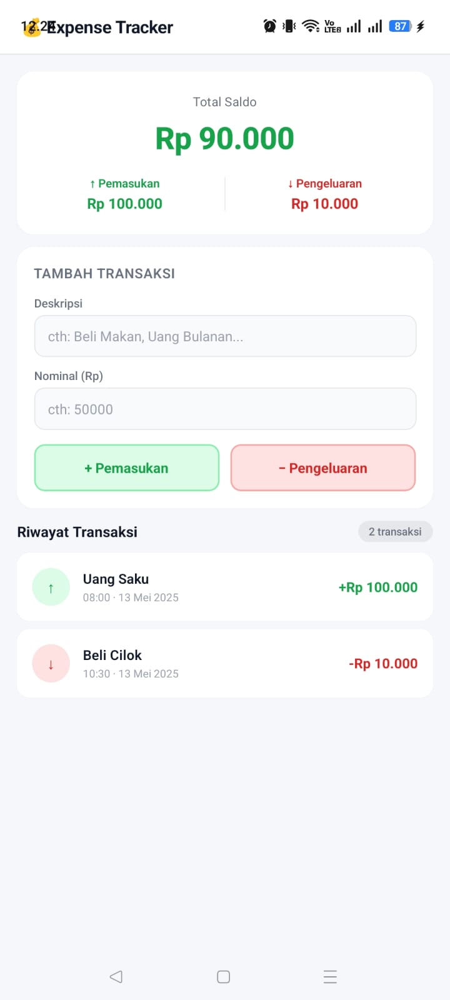

💰 Project UTS: DompetKu ⚡
📸 Preview

🛠️ Logic yang Diterapkan

Aplikasi ini menggunakan useState untuk mengelola data transaksi keuangan, termasuk penyimpanan deskripsi dan nominal. Pengguna dapat menambahkan transaksi pemasukan maupun pengeluaran melalui input yang telah disediakan. Setiap transaksi akan langsung memperbarui total saldo secara otomatis.

Selain itu, aplikasi juga menggunakan FlatList untuk menampilkan daftar riwayat transaksi secara efisien. Sistem juga menerapkan conditional styling, di mana pemasukan ditampilkan dengan warna hijau dan pengeluaran dengan warna merah agar lebih mudah dibedakan.

💡 Fitur Utama

Aplikasi ini memiliki fitur utama berupa tampilan saldo total yang dimulai dari Rp 0, penambahan transaksi baru, serta riwayat transaksi yang ditampilkan secara berurutan. Setiap perubahan data akan langsung diperbarui secara real-time pada tampilan aplikasi.

🧾 Struktur Data

Data transaksi disimpan dalam bentuk array objek yang berisi id, keterangan transaksi, nominal, dan tipe transaksi (masuk atau keluar). Struktur ini digunakan untuk mempermudah proses perhitungan saldo dan penampilan data di daftar riwayat.

🔗 Demo

Aplikasi dapat dijalankan melalui Expo Snack pada link berikut:
https://snack.expo.dev/
